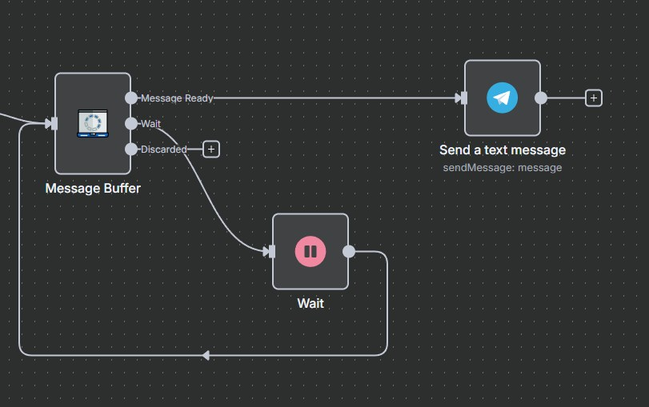

# n8n Message Buffer Node

This custom n8n node solves a common problem in chatbot and agent workflows: users often send their requests in multiple, fragmented messages over a short period.

User Message 1: Hi, I need info

User Message 2: about your business

User Message 3: and its products

This can confuse AI agents, as they process each message as a separate request. The Message Buffer node intelligently waits and consolidates these fragments into a single, coherent message before passing it on.

## ⚠️ Very Important: Testing the Node

To properly test the Message Buffer node, your n8n workflow **must be active**.

If you try to test it using the "Test workflow" button, it will only capture a single message. This is because test executions run only once, whereas an active workflow runs continuously, allowing the node to listen for and buffer multiple messages as intended.

Always activate your workflow to see the node working correctly.

## How It Works

The node uses a Redis backend and a smart polling loop to achieve this without blocking the n8n workflow.

When a new message arrives, the node stores it in a Redis list and starts (or resets) a timer key with a specific Time-To-Live (TTL).

It then outputs a signal through its wait output.

This signal enters a polling loop, continuously checking the status of the Redis timer.

If a new message from the same user arrives, the timer is reset.

Once the timer finally expires (meaning the user has stopped typing), the node fetches all stored messages, consolidates them, and sends the final, complete message through the messageReady output, stopping the loop.

## Installation on local n8n instance

1.  Clone this repository.
2.  Navigate to the repository's root directory.
3.  Install dependencies: `npm install`
4.  Build the node: `npm run build`
5.  Link the node to your n8n installation:
    - Run `npm link` in this project's directory.
    - Run `npm link n8n-nodes-message-buffer` in your n8n installation directory.
6.  Restart your n8n instance.

## Installation on n8n cloud

1. Go to the n8n Settings.
2. Select the "Community nodes" menu.
3. Click on the "Install" button.
4. Enter the package name: `n8n-nodes-message-buffer`.
5. Click on the "Install" button.
6. Restart your n8n instance.

## Credentials

First, you'll need to configure your Redis credentials. Select the corresponding Redis credential from the credentials dropdown or create a new one and fill in your Redis connection details (host, port, password, etc.).

## Parameters

- **Conversation Key**: (Required) A unique identifier for the conversation, like a userId or chatId. This is crucial to ensure messages from different users are not mixed. Example: {{ $json.userId }}.
- **Message Field**: The name of the field in the incoming JSON that contains the message text. Defaults to text.
- **Output Field Name**: The name of the new field for the consolidated message. Defaults to consolidatedMessage.
- **Wait Time (seconds)**: The duration to wait after the last message is received before consolidating. Each new message resets this timer. Defaults to 5 seconds.

### Outputs

The node has three outputs:

1. **wait**: This output is used to manage the polling loop. It sends a signal that should be used to re-trigger the node after a short delay.

2. **messageReady**: Once the wait time has passed without new messages, this output will emit a single item containing the consolidated message. The final text is available in the field specified by the Message Field parameter.

3. **discarded**: Its purpose is to support **internal control and traceability** by clearly separating cases that should not impact the agent flow. This output is triggered only for executions that **do not meet the minimum requirements** to be processed, such as:
   - Empty or malformed message content.
   - Events with no messages available for consolidation.

> ⚠️ **Important:** Do not connect any actionable nodes to this output. It is designed solely for debugging, logging, or analysis. You may leave it unconnected or route it to lightweight nodes such as `No Operation` or `Set` if you wish to monitor discarded executions.

## ⚠️ Crucial Setup: The Polling Loop

For this node to function correctly, you must create a polling loop in your workflow. This is done by connecting the node back to itself through an n8n Wait node.

### Setup Steps:

1. Connect the wait output of the Message Buffer node to the input of a standard n8n Wait node.

2. Configure the Wait node to wait for 1 second. This delay prevents the loop from overwhelming your system.

3. Connect the output of the Wait node back to the input of the same Message Buffer node.

Your workflow setup should look exactly like this:

This configuration ensures that the node can continuously check if it's time to send the consolidated message, without ever blocking the execution thread.

## License

MIT
